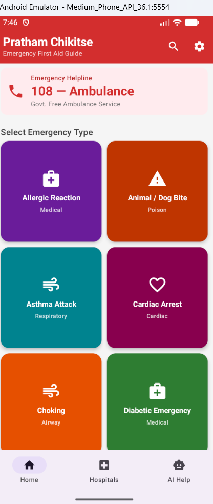
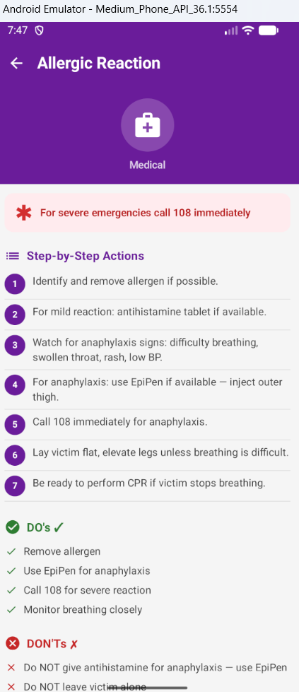
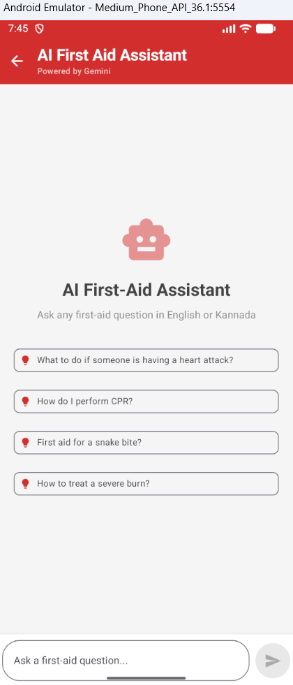
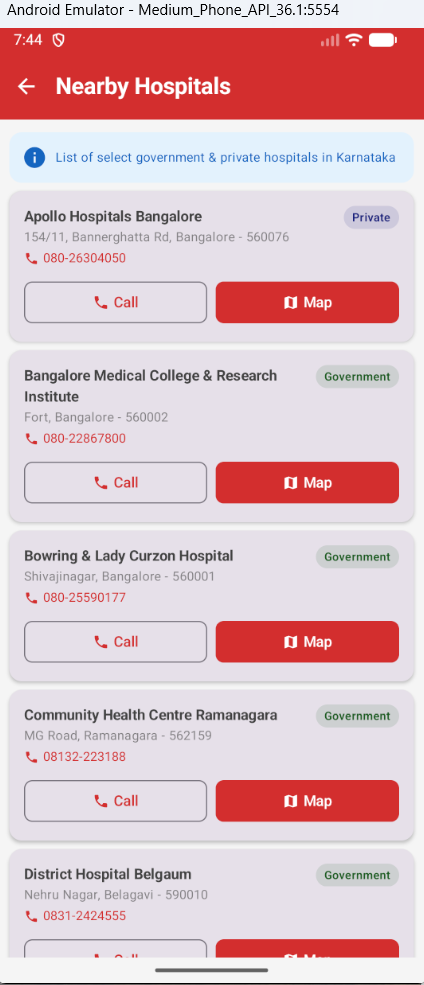
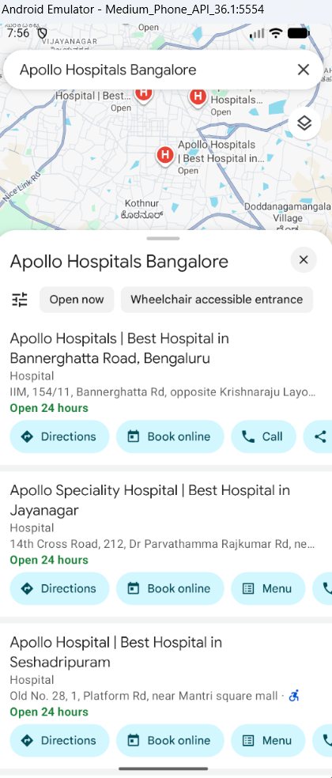

# 🩺 Pratham Chikitse — Emergency First Aid Android App

A bilingual (English + Kannada) AI-powered Android first-aid guide app designed for rural Karnataka.  
The app provides instant emergency guidance, offline first-aid instructions, AI assistance, and nearby hospital access.

---

# 📱 App Screenshots

## 🏠 Home Screen
Emergency categories with quick access to first-aid guidance.

<p align="center">
  
</p>

---

## 🚑 Emergency Detail Screen
Step-by-step emergency instructions with DOs & DON'Ts.

<p align="center">
  
</p>

---

## 🤖 AI First Aid Assistant
Ask first-aid questions in English or Kannada using GROQ AI.

<p align="center">
  
</p>

---

## 🏥 Nearby Hospitals Screen
Find nearby Karnataka hospitals with quick call & map support.

<p align="center">
  
</p>

---

## 🗺️ Google Maps Integration
Open hospitals directly in Google Maps for navigation.

<p align="center">
  
</p>

---

# ✨ Features

- 🚨 **20 Emergency Cards**  
  Step-by-step first-aid guidance for:
  - Snake bite
  - Choking
  - Cardiac arrest
  - Burns
  - Fractures
  - Asthma attack
  - Allergic reactions
  - And more

- 🇮🇳 **Bilingual Support**
  - English
  - Kannada
  - Live language toggle

- 🤖 **GROQ AI Assistant**
  - Ask first-aid questions naturally
  - Supports English & Kannada

- 🏥 **Hospital Finder**
  - Karnataka hospitals list
  - One-tap call support
  - Google Maps integration

- 🔍 **Search Functionality**
  - Search emergencies instantly
  - Works in both languages

- 📦 **Offline-First Architecture**
  - Uses Room Database
  - Pre-seeded bundled JSON data

- 🌙 **Dark Mode Support**

- 💉 **DOs and DON'Ts**
  - Every emergency includes safety precautions

---

# 🛠️ Tech Stack

| Layer | Technology |
|---|---|
| Language | Kotlin |
| UI | Jetpack Compose + Material 3 |
| Navigation | Compose Navigation |
| Database | Room (SQLite) |
| Dependency Injection | Hilt |
| AI | Groq (llama 3.3) |
| Preferences | DataStore |
| Build System | Gradle with Version Catalog |

---

# ⚙️ Setup Instructions

## 1️⃣ Open in Android Studio
File → Open → Select the `PrathamChikitse` folder.

## 2️⃣ Add Your Gemini API Key

Get a **free** API key from https://console.groq.com

Open `local.properties` and replace the placeholder:
```
GROQ_API_KEY=AIza...your-actual-key...
```

> ⚠️ The app works fully offline without the key — only the AI chat tab requires it.

## 3️⃣ Set SDK Path in local.properties
Android Studio auto-fills this. If not:
```
sdk.dir=/Users/your-name/Library/Android/sdk
```

## 4️⃣ Sync & Run
- Click **Sync Now** in Android Studio
- Run on an emulator (API 21+) or physical device

---

## App Structure

```
app/src/main/java/com/pratham/chikitse/
├── data/
│   ├── dao/          # Room DAOs (EmergencyDao, HospitalDao)
│   ├── database/     # AppDatabase
│   ├── model/        # Emergency, Hospital entities
│   └── repository/   # EmergencyRepository, HospitalRepository
├── di/               # Hilt AppModule
├── ui/
│   ├── ai/           # Gemini AI chat screen
│   ├── emergency/    # Detail screen for each emergency
│   ├── home/         # Home grid screen
│   ├── hospital/     # Hospital list with call/map
│   ├── search/       # Full-text search
│   ├── settings/     # Language & dark mode toggle
│   └── theme/        # Material 3 color scheme
└── util/
    ├── GeminiHelper.kt
    └── PreferencesHelper.kt
app/src/main/assets/
├── emergencies.json  # 20 emergencies (EN + KN)
└── hospitals.json    # 20 Karnataka hospitals
```

---

## Emergency Call Numbers

| Service     | Number |
|-------------|--------|
| Ambulance   | **108** |
| Police      | 100 |
| Fire        | 101 |
| Women Help  | 1091 |

---

## Note on AI
The AI assistant uses `Llama 3.3` model. If `GROQ_API_KEY` is not set, it shows a helpful error message. The rest of the app functions completely offline.
